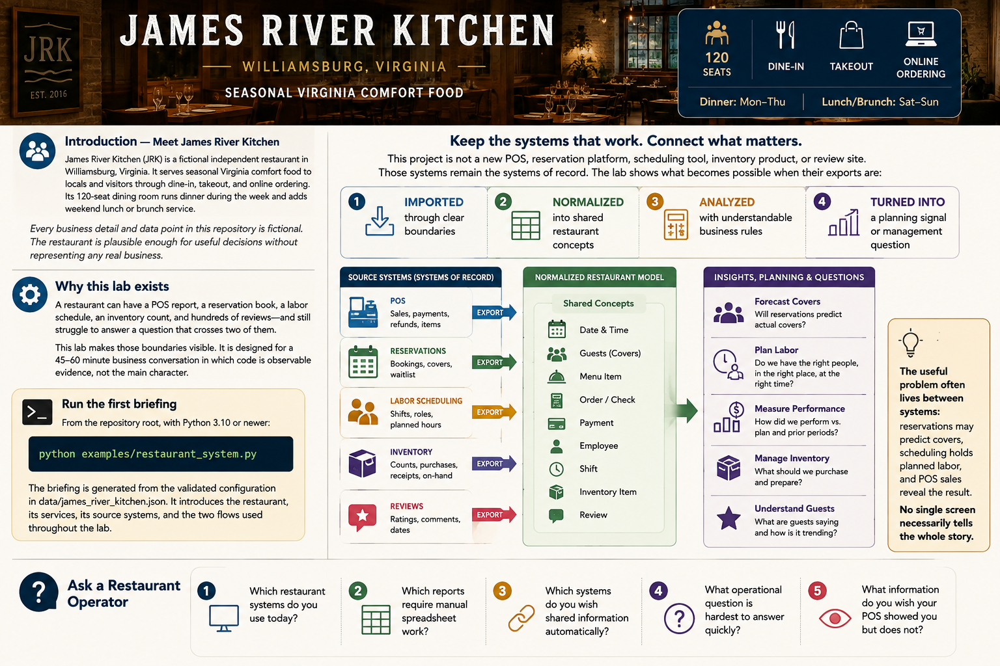

# Introduction — Meet James River Kitchen



## Why this lab exists

A restaurant can have a POS report, a reservation book, a labor schedule, an inventory count, and hundreds of reviews—and still struggle to answer a question that crosses two of them.

This lab makes those boundaries visible. It is designed for a 45–60 minute business conversation in which code is observable evidence, not the main character.

## Meet the restaurant

**James River Kitchen** is a fictional independent restaurant in Williamsburg, Virginia. It serves seasonal Virginia comfort food to locals and visitors through dine-in, takeout, and online ordering. Its 120-seat dining room runs dinner during the week and adds weekend lunch or brunch service.

Every business detail and data point in this repository is fictional. The restaurant is plausible enough for useful decisions without representing any real business.

## Keep the systems that work

This project is not a new POS, reservation platform, scheduling tool, inventory product, or review site. Those systems remain the systems of record. The lab shows what becomes possible when their exports are:

1. imported through clear boundaries;
2. normalized into shared restaurant concepts;
3. analyzed with understandable business rules; and
4. turned into a planning signal or management question.

The useful problem often lives **between** systems: reservations may predict covers, scheduling holds planned labor, and POS sales reveal the result. No single screen necessarily tells the whole story.

## Run the first briefing

From the repository root, with Python 3.10 or newer:

```bash
python examples/restaurant_system.py
```

The briefing is generated from the validated configuration in `data/james_river_kitchen.json`. It introduces the restaurant, its services, its source systems, and the two flows used throughout the lab.

## Ask a Restaurant Operator

- Which restaurant systems do you use today?
- Which reports require manual spreadsheet work?
- Which systems do you wish shared information automatically?
- What operational question is hardest to answer quickly?
- What information do you wish your POS showed you but does not?
