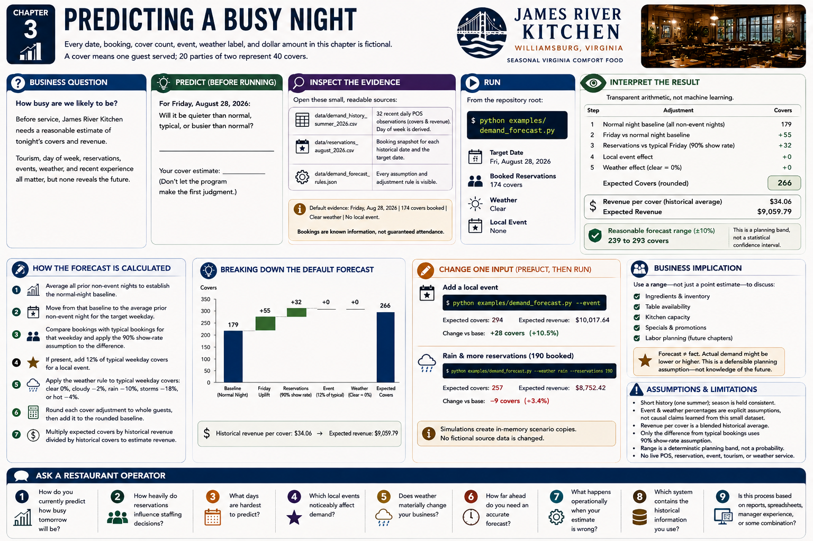

# Chapter 3 — Predicting a Busy Night



Every date, booking, cover count, event, weather label, and dollar amount in this chapter is **fictional**. A **cover** means one guest served; 20 parties of two represent 40 covers.

### Business question

**How busy are we likely to be?** Before service, James River Kitchen needs a reasonable estimate of tonight's covers and revenue. Tourism, day of week, reservations, events, weather, and recent experience all matter, but none reveals the future.

### Predict

Before running the model, predict whether Friday, August 28 will be quieter than normal, typical, or busier than normal. Then write down a cover estimate. Do not let the program make the first judgment.

### Inspect the evidence

Open these deliberately small, readable sources:

- `data/demand_history_summer_2026.csv` contains 32 recent daily POS observations. Day of week is derived from each date, rather than duplicated.
- `data/reservations_august_2026.csv` contains the booking snapshot for each historical date and the target date.
- `data/demand_forecast_rules.json` makes every assumption visible.

The default evidence is Friday, August 28, 2026; 174 covers booked; clear weather; and no local event. Bookings are **known information**, not guaranteed attendance. The output separately shows reservations already booked and estimated walk-ins/other demand.

### Run

From the repository root:

```bash
python examples/demand_forecast.py
```

### Interpret

This is transparent arithmetic, not machine learning:

1. Average all prior non-event nights to establish the normal-night baseline.
2. Move from that baseline to the average prior non-event night for the target weekday.
3. Compare bookings with typical bookings for that weekday and apply the documented 90% show-rate assumption to the difference.
4. If present, add 12% of typical weekday covers for a local event.
5. Apply the weather rule to typical weekday covers: clear 0%, cloudy −2%, rain −10%, storms −18%, or hot −4%.
6. Round each cover adjustment to whole guests, then add it to the rounded baseline.
7. Multiply expected covers by historical revenue divided by historical covers to estimate revenue.

For the default data, this produces 266 expected covers: a rounded 179-cover normal-night baseline, +55 for Friday, +32 for above-typical reservations, and no event or clear-weather change. Historical revenue per cover is $34.06, yielding $9,059.79 expected revenue.

The **reasonable forecast range** is expected covers plus or minus 10%, with each side rounded to whole covers. It is a simple communication rule, not a statistical confidence interval. Its purpose is to keep uncertainty visible.

> **Forecast ≠ fact.**
>
> Actual demand might be lower or higher. The forecast gives management a defensible planning assumption, not knowledge of the future.

### Change one input

Predict what happens if a local event is announced, then run:

```bash
python examples/demand_forecast.py --event
```

The program shows the changed forecast and compares it with the unmodified base scenario. Try a second combination:

```bash
python examples/demand_forecast.py --weather rain --reservations 190
```

The extra bookings increase the reservation signal while rain reduces the weather signal. Because those effects are separately printed, the audience can explain the net result before trusting it.

### Run again

The event scenario produces 294 covers, 28 above the 266-cover base. The rain/190-reservation scenario produces 257 covers, 9 below the base. Both simulations create immutable in-memory scenario copies; neither edits fictional source data.

### Business implication

Management can use a range—not just a point estimate—to discuss ingredients, table availability, kitchen capacity, specials, and eventually labor. Those operational choices require more constraints and operator judgment; this chapter does not make them.

Ask the room: **If we expect about 290 guests, what decision would you make next—and what else would you need to know?**

## Assumptions and limitations

- The short history represents one summer period, so season is held reasonably consistent rather than modeled as a separate multiplier.
- Event and weather percentages are explicit workshop assumptions, not causal claims learned from this small dataset.
- Revenue per cover is a blended historical average and does not predict menu mix, discounts, tax, or tips.
- Reservations can cancel or no-show; only the difference from typical bookings receives the 90% show-rate assumption.
- The range is a deterministic planning band, not a probability statement.
- No live POS, reservation, event, tourism, or weather service is connected.

## Ask a Restaurant Operator

- How do you currently predict how busy tomorrow will be?
- How heavily do reservations influence staffing decisions?
- What days are hardest to predict?
- Which local events noticeably affect demand?
- Does weather materially change your business?
- How far ahead do you need an accurate forecast?
- What happens operationally when your estimate is wrong?
- Which system contains the historical information you use?
- Is this process based on reports, spreadsheets, manager experience, or some combination?
