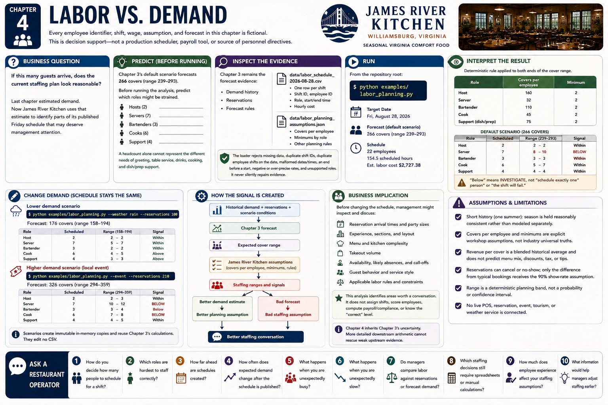

# Chapter 4 — Labor vs. Demand



Every employee identifier, shift, wage, assumption, and forecast here is **fictional**. This is decision support—not a production scheduler, payroll tool, or source of personnel directives.

### Business question

**If this many guests arrive, does the current staffing plan look reasonable?** Last chapter estimated demand. Now James River Kitchen uses that estimate to identify parts of its published Friday schedule that may deserve management attention.

### Predict

Chapter 3's default scenario forecasts **266 covers**, with a reasonable range of **239–293**. The schedule has 22 fictional employees: 2 hosts, 7 servers, 3 bartenders, 6 cooks, and 4 support staff. Before running the analysis, predict which roles might be strained. A headcount alone cannot represent the different needs of greeting, table service, drinks, cooking, and dish/prep support.

### Inspect the evidence

- Chapter 3's demand history, reservations, and forecast rules remain the forecast evidence.
- `data/labor_schedule_2026-08-28.csv` has one inspectable row per shift: a unique shift ID, fictional employee ID, role, start/end, and hourly cost.
- `data/labor_planning_assumptions.json` contains the **James River Kitchen planning assumptions**.

The loader rejects missing data, duplicate shift IDs, duplicate employee shifts on the date, malformed dates or times, an end before a start, negative or over-precise rates, and unsupported roles. It never silently repairs evidence.

The 154.5 scheduled hours cost an estimated $2,727.38. This is duration multiplied by hourly cost using decimal arithmetic. It is not payroll or fully loaded accounting cost: taxes, benefits, breaks, overtime, and legal rules are outside this simulation.

### Run

```bash
python examples/labor_planning.py
```

### Interpret

The program calls Chapter 3's `forecast_demand` first, then applies this deterministic rule to both ends of its cover range:

```text
planning count = maximum(role minimum, ceiling(forecast covers ÷ covers per employee))
```

| Role | Covers per employee | Minimum |
|---|---:|---:|
| Host | 160 | 2 |
| Server | 32 | 2 |
| Bartender | 110 | 2 |
| Cook | 45 | 2 |
| Support (dish/prep/service support) | 75 | 2 |

These are transparent fictional inputs, **not restaurant-industry universal truths**. The default result places servers below the 8–10 range; the other roles fall within their ranges. “Below” means “investigate,” not “schedule exactly one person” or “the shift will fail.” “Above” similarly does not recommend cutting a shift.

### Change demand

Keep the source schedule fixed and lower demand:

```bash
python examples/labor_planning.py --weather rain --reservations 100
```

Then try a higher-demand event:

```bash
python examples/labor_planning.py --event --reservations 210
```

The flags create immutable scenario copies and reuse Chapter 3's reservation, event, weather, range, and revenue calculations. They edit no CSV.

### Run again

The low scenario forecasts 176 covers and the server range becomes 5–7, so seven scheduled servers appear aligned. The high scenario forecasts 326 covers; the server range becomes 10–12 and cook range 7–8, while the schedule remains seven servers and six cooks.

> **The schedule didn't change. Our understanding of demand did.**

```text
Historical demand + reservations + scenario conditions
                         ↓
                Chapter 3 forecast
                         ↓
             expected cover range
                         ↓
       James River Kitchen assumptions
                         ↓
           staffing ranges and signals
```

```text
Better demand estimate       Bad forecast
        ↓                         ↓
Better planning assumption   Bad staffing assumption
        ↓
Better staffing conversation
```

Chapter 4 inherits Chapter 3's uncertainty. More detailed downstream arithmetic cannot rescue weak upstream evidence.

### Business implication

Before changing the schedule, management might inspect reservation arrival times and party sizes, experience, sections and layout, service style, menu and kitchen complexity, takeout, availability, likely absences, guest behavior, and applicable labor rules. This identifies areas worth a conversation. It does not assign shifts, score employees, compute payroll/compliance, or know the “correct” level.

## Ask a Restaurant Operator

- How do you decide how many people to schedule for a shift?
- Which roles are hardest to staff correctly?
- How far ahead are schedules created?
- How often does expected demand change after the schedule is published?
- What happens when you are unexpectedly busy?
- What happens when you are unexpectedly slow?
- Do managers compare labor against reservations or forecast demand?
- Which staffing decisions still require spreadsheets or manual calculations?
- How much does employee experience affect your staffing assumptions?
- What information would help managers adjust staffing earlier?
