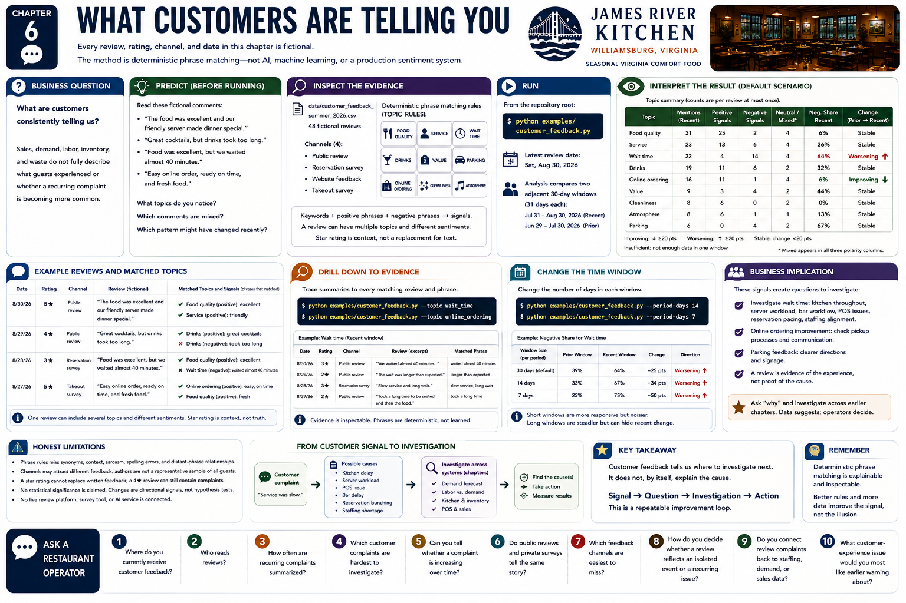

# Chapter 6 — What Customers Are Telling You



Every review, rating, channel, and date in this chapter is **fictional**. The method is deterministic phrase matching—not AI, machine learning, or a production sentiment system.

### Business question

**What are customers consistently telling us?** James River Kitchen can see sales, demand, labor, inventory, and waste. Those records do not fully describe what guests experienced or whether a recurring complaint is becoming more common.

### Predict

Read these fictional comments before running the analysis:

> “The food was excellent and our friendly server made dinner special.”

> “Great cocktails, but drinks took too long.”

> “Food was excellent, but we waited almost 40 minutes.”

> “Easy online order, ready on time, and fresh food.”

What topics do you notice? Which comments are mixed? Which pattern might have changed recently? Write down a prediction before seeing the aggregate.

### Inspect the evidence

Open `data/customer_feedback_summer_2026.csv`. Its 48 fictional records expose `review_id`, ISO date, 1–5 rating, channel, and original text. The four supported channels are public review, reservation survey, website feedback, and takeout survey.

Then inspect `TOPIC_RULES` in `src/restaurant_lab/feedback_analysis.py`. The manageable taxonomy is:

```text
food_quality  service  wait_time  drinks  value  parking
online_ordering  cleanliness  atmosphere
```

Every topic lists identifying keywords plus positive and negative phrases. Text is lowercased, apostrophes and punctuation are normalized, and whitespace is collapsed. A matching topic with only a keyword is neutral; positive and negative phrase matches create the respective signal; both produce a mixed signal. One review can retain several topics and different sentiments. The star rating remains contextual evidence and never overwrites written signals.

### Run

```bash
python examples/customer_feedback.py
```

### Interpret

The report counts each topic at most once per review and shows mentions, positive signals, negative signals, and neutral/mixed signals. A mixed mention appears in all three polarity columns so neither written experience is erased; polarity columns therefore need not sum to mentions.

The default analysis compares two adjacent 30-day windows ending on the latest review date:

```text
negative share = negative topic signals / topic mentions
```

A movement of at least 20 percentage points is labeled **Improving** or **Worsening**; a smaller movement is **Stable**. A topic absent from either window is marked as insufficient for comparison. These are workshop signals, not statistical tests, and no statistical significance is claimed.

Food quality is the strongest positive theme. Wait-time negative share rises in the recent window, while online-ordering negative share falls. Cocktails receive praise and criticism. Parking remains a small, mostly negative issue without crossing the directional threshold. Ratings can corroborate the text, but an average cannot replace it: a four-star comment may still contain excellent food and slow service.

### Drill down

Trace summaries to every matching fictional record and exact matched phrase:

```bash
python examples/customer_feedback.py --topic wait_time
python examples/customer_feedback.py --topic online_ordering
```

This inspectable evidence is the safeguard against treating a summary label as unquestionable truth.

### Change the time window

The option is the number of days in **each** of two adjacent windows:

```bash
python examples/customer_feedback.py --period-days 14
python examples/customer_feedback.py --period-days 7
```

### Run again

Compare counts, negative shares, and direction labels. A short window is more responsive but contains fewer observations; a longer window is steadier but can hide a recent shift. Aggregation window matters. The command changes only an in-memory boundary and never mutates the CSV.

### Business implication

Wait complaints tell management where to investigate: kitchen throughput, reservation pacing, server workload, bar workflow, POS disruptions, and staffing alignment. Online-ordering improvement may invite a check of pickup processes. Parking feedback may motivate clearer directions. None follows automatically from a keyword.

```text
Customer symptom
        ≠
Known operational cause

Customer says: “Service was slow.”
Possible causes: kitchen delay, server workload, POS issue, bar delay,
reservation bunching, or staffing shortage.
```

A review is evidence of the **experience**, not proof of the cause. It creates questions for earlier chapters:

```text
Wait-time complaints
        ↓
Check demand forecast
        ↓
Check staffing alignment
        ↓
Check kitchen and inventory conditions
```

That path is an investigation, not a causal claim. A customer signal tells us where to investigate next.

### Honest limitations

Phrase rules miss synonyms, context, sarcasm, spelling errors, and relationships between distant clauses. “The wait wasn't bad” is handled by a specific positive phrase, but language outside visible rules may be missed or misread. Channels may attract different feedback, and authors are not necessarily representative of all guests. Managers should inspect evidence and revise documented rules rather than mistake the output for ground truth.

## Ask a Restaurant Operator

- Where do you currently receive customer feedback?
- Who reads reviews?
- How often are recurring complaints summarized?
- Which customer complaints are hardest to investigate?
- Can you tell whether a complaint is increasing over time?
- Do public reviews and private surveys tell the same story?
- Which feedback channels are easiest to miss?
- How do managers decide whether a review reflects an isolated event or a recurring issue?
- Do you connect review complaints back to staffing, demand, or sales data?
- What customer-experience issue would you most like earlier warning about?
